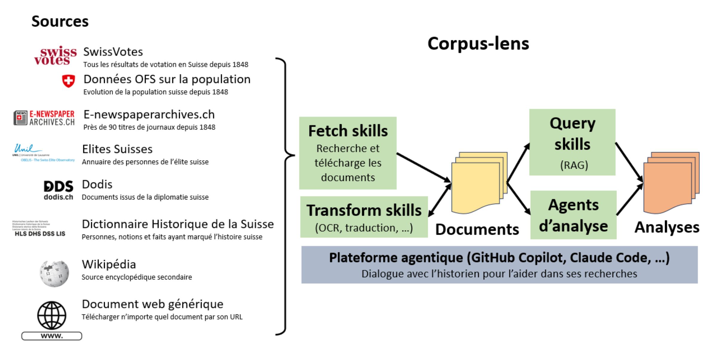

# Corpus-lens

## Objectif du projet

`corpus-lens` est un assistant de recherche historique fondé sur un **LLM** combiné à une architecture **RAG** (Retrieval-Augmented Generation), des **skills** automatisés et des **agents spécialisés**.

Sa mission est d'aider un historien de la Suisse à :
- collecter rapidement des sources pertinentes ;
- organiser et indexer ces sources de manière exploitable ;
- interroger le corpus avec l'appui d'un LLM.

Le projet est conçu comme un **outil d'assistance** : il n'a pas pour but de remplacer le travail d'analyse et d'interprétation de l'historien, mais d'en améliorer la productivité et la traçabilité.

## Fonctionnalités principales

### 1) Collecte de sources hétérogènes

Le projet intègre des workflows pour télécharger et préparer des sources de différentes natures, avec un accent particulier sur les sources historiques suisses :
- **articles de journaux** (presse numérisée, e-newspaper) ;
- **documents officiels** (p. ex. documents liés aux votations fédérales, Swissvotes, Confédération) ;
- **sources encyclopédiques et diplomatiques** (DHS, Dodis, ElitesSuisses) ;
- **données quantitatives** (p. ex. évolution de la population, résultats de votations).


### 2) Extraction et normalisation documentaire

Les documents récupérés (notamment PDF/HTML) peuvent être transformés en Markdown structuré, avec pagination et métadonnées, afin de faciliter :
- la lecture humaine ;
- l'indexation automatique ;
- la citation et la vérification des passages.

### 3) Indexation centralisée des sources

Le projet maintient un index canonique des sources dans `named_entities.sqlite` (table `source`) pour :
- éviter les doublons ;
- stabiliser les identifiants techniques ;
- garantir une base cohérente pour les analyses ultérieures.

### 4) Recherche assistée par LLM (RAG)

Une fois les sources validées et indexées, l'historien peut :
- poser des questions au corpus ;
- obtenir des réponses ancrées dans les documents ;
- naviguer plus vite entre faits, acteurs, périodes et controverses.

L'approche RAG vise à renforcer la qualité des réponses en s'appuyant sur des sources explicites plutôt que sur des connaissances implicites non vérifiables.

### 5) Orchestration multi-agents

Le système repose sur des agents et des skills spécialisés qui découpent le travail en étapes reproductibles :
- collecte ;
- préparation ;
- indexation ;
- analyse guidée ;
- rédaction de livrables.

Cette orchestration améliore la robustesse du pipeline et la réutilisabilité des méthodes de recherche.

## Flux de travail type

1. **Collecter** des sources avec les skills adaptés (Swissvotes, DHS, Dodis, e-newspaper, URLs génériques, etc.).
2. **Transformer** les documents dans un format exploitable (Markdown paginé, métadonnées).
3. **Indexer** les sources dans la base commune.
4. **Interroger** le corpus via le LLM pour accélérer l'exploration.
5. **Interpréter** les résultats du point de vue historien, avec validation critique des sources.

## Positionnement méthodologique

Le projet suit un principe central :
- **le jugement historique reste humain** ;
- **le LLM sert d'accélérateur documentaire**.

Autrement dit, l'outil assiste la recherche (repérage, synthèse initiale, navigation dans les sources), tandis que l'analyse scientifique, la contextualisation et les conclusions demeurent sous la responsabilité de l'historien.

## Requiert

- Framework IA agentique (p.ex. GitHub Copilot, OpenAI Codex, Claude Code)
- Python **3.14 ou superieur**
- Acces internet (LLM, sources de donnees, telechargement des dependances)

## Configuration Python (CLI)

Le projet fournit un script unique `setup.ps1` pour creer le venv et installer:

- la version Python cible du projet (`.python-version` = `3.14`)
- les dependances obligatoires (`requirements-required.txt`)
- les dependances optionnelles (`requirements-optional.txt`)
- Chromium pour Playwright
- les modeles spaCy (`fr_core_news_lg`, `de_core_news_lg`)
- la base SQLite `named_entities.sqlite` (initialisation)

### Installation standard

```powershell
.\setup.ps1
```
L'installation prend plusieurs minutes car il y a environ 2 GB de téléchargement (librairies, modèles, ...).

### Avec un executable Python explicite

```powershell
.\setup.ps1 -PythonExe "C:\Path\To\Python314\python.exe"
```

### Activation du venv

```powershell
.\.venv\Scripts\Activate.ps1
```

### Options utiles

- `-SkipOptional` : saute les librairies optionnelles.
- `-SkipPlaywrightBrowsers` : saute `playwright install chromium`.
- `-SkipSpacyModels` : saute le telechargement des modeles spaCy.
- `-SkipDbInit` : saute l'initialisation de la base SQLite.
